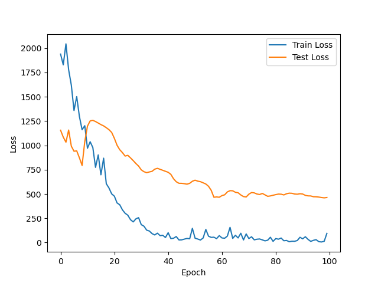
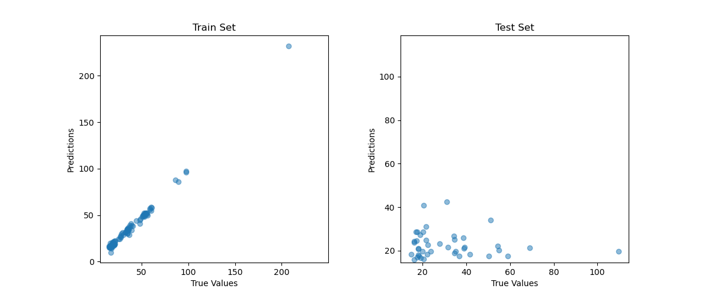

### 数据集

140 条长度为 30的序列 

### 编码方式

- one-hot 编码

```python
char_map = {
    'A': [1, 0, 0, 0],
    'T': [0, 1, 0, 0],
    'C': [0, 0, 1, 0],
    'G': [0, 0, 0, 1]
}
```

- triplet 编码

将三个碱基为一组进行编码，用 长度为64 的向量

表示如‘AAA’会被编码为[1,0,...,0]

一个长度为30的序列会被编码成为一个64*28的矩阵

### 模型

#### GoogLeNet

是一种卷积神经网络（CNN）架构，由Szegedy等人于2014年在论文《Going Deeper with Convolutions》中提出。该模型在当时的ImageNet大规模视觉识别挑战赛（ILSVRC）中获得了最佳结果，引领了深度学习模型向更深层次发展的趋势。

GoogLeNet的一个关键创新是引入了Inception模块。Inception模块是一种特殊的卷积层，通过将不同大小的卷积核（例如1x1、3x3和5x5）和池化层并行堆叠在一起，可以让模型在不同尺度上捕捉图像特征。这种设计有效地减少了参数数量，同时提高了计算效率。

GoogLeNet共有22层，包括卷积层、全连接层和池化层。除了Inception模块，GoogLeNet还引入了两个辅助分类器（auxiliary classifiers），分别连接在网络的中间层。这两个辅助分类器在训练过程中帮助梯度更好地传播，有助于提高模型的收敛速度。

#### MobileNet

### 结果

#### GoogLeNet





#### MobileNet