### 数据集

rbs 140 条长度为 30的序列 

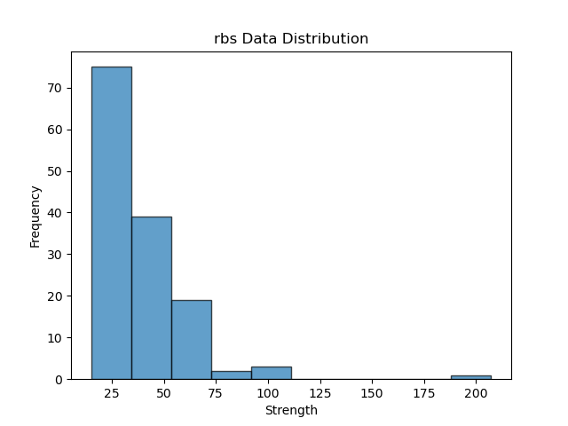

promoter 591条长度为61的序列

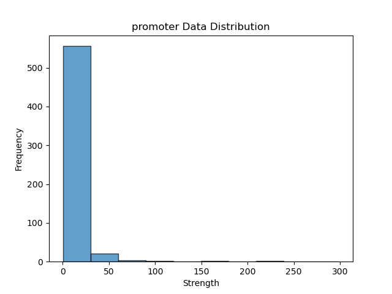

### 编码方式

- one-hot 编码

```python
char_map = {
    'A': [1, 0, 0, 0],
    'T': [0, 1, 0, 0],
    'C': [0, 0, 1, 0],
    'G': [0, 0, 0, 1]
}
```

- triplet 编码

将三个碱基为一组进行编码，用 长度为64 的向量

表示如‘AAA’会被编码为[1,0,...,0]

一个长度为30的序列会被编码成为一个64*28的矩阵

### 模型

#### GoogleNet

是一种卷积神经网络（CNN）架构，由Szegedy等人于2014年在论文《Going Deeper with Convolutions》中提出。该模型在当时的ImageNet大规模视觉识别挑战赛（ILSVRC）中获得了最佳结果，引领了深度学习模型向更深层次发展的趋势。

GoogLeNet的一个关键创新是引入了Inception模块。Inception模块是一种特殊的卷积层，通过将不同大小的卷积核（例如1x1、3x3和5x5）和池化层并行堆叠在一起，可以让模型在不同尺度上捕捉图像特征。这种设计有效地减少了参数数量，同时提高了计算效率。

GoogLeNet共有22层，包括卷积层、全连接层和池化层。除了Inception模块，GoogLeNet还引入了两个辅助分类器（auxiliary classifiers），分别连接在网络的中间层。这两个辅助分类器在训练过程中帮助梯度更好地传播，有助于提高模型的收敛速度。

#### MobileNet

MobileNet是一种轻量级的卷积神经网络（CNN）架构，主要设计用于在移动设备和嵌入式系统上执行图像识别和分类任务。与其他卷积神经网络相比，MobileNet的优势在于其较低的计算复杂度和更少的参数量，这使得它能够在有限的计算资源下实现较高的性能。

MobileNet的核心思想是使用深度可分离卷积（depthwise separable convolution）来降低计算成本。深度可分离卷积将标准的卷积操作拆分为两个步骤：深度卷积（depthwise convolution）和逐点卷积（pointwise convolution）。这种结构有效地减少了计算量和模型参数，同时保持了较好的性能。

MobileNet还采用了宽度乘子和分辨率乘子两个超参数来控制网络的大小和计算量。宽度乘子用于调整每个卷积层的通道数，而分辨率乘子用于调整输入图像的尺寸。通过调整这两个超参数，可以根据具体应用场景的需求和设备的计算能力来平衡模型的性能和计算成本。

### 结果

#### RBS

GoogleNet

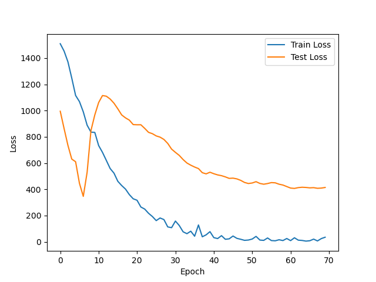

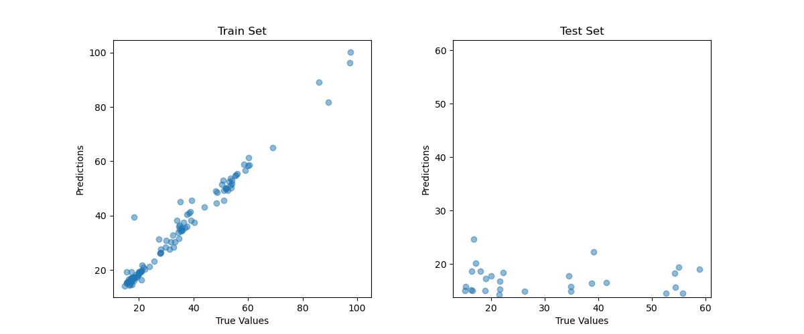

MobileNet

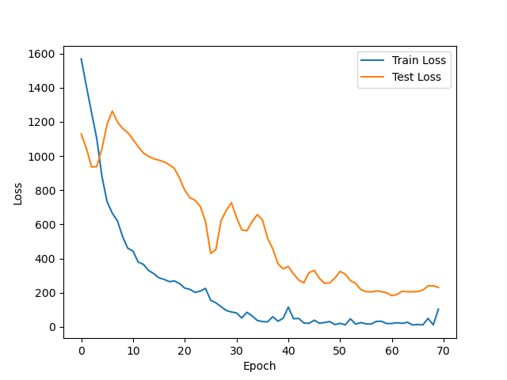

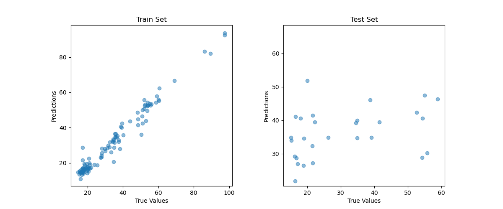

#### 启动子

GoogleNet

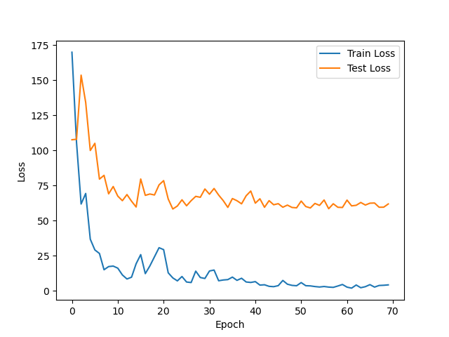

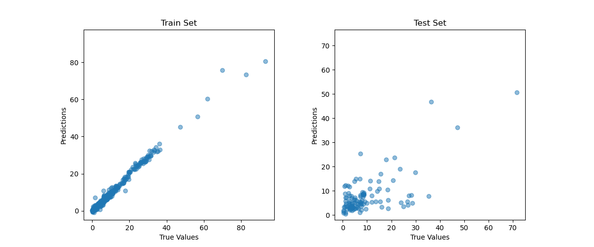

MobileNet

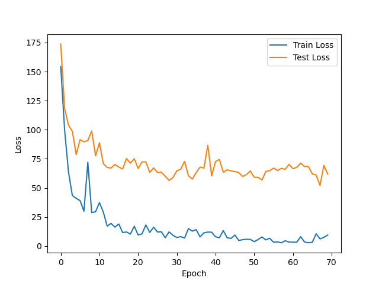

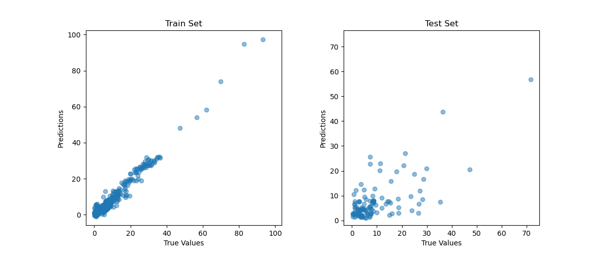

### 评价

**皮尔逊相关系数（Pearson Correlation Coefficient）：**

皮尔逊相关系数是衡量两个变量之间线性相关程度的指标。它的值范围在 -1 和 1 之间。当系数接近 1 时，表示两个变量呈正相关；当系数接近 -1 时，表示两个变量呈负相关；当系数接近 0 时，表示两个变量之间的线性关系很弱。

皮尔逊相关系数公式为：

```
r = Σ((xi - μx)(yi - μy)) / √(Σ(xi - μx)^2 * Σ(yi - μy)^2)
```

其中 r 为相关系数，xi 和 yi 分别为两个变量的观测值，μx 和 μy 分别为这两个变量的均值。

**平均绝对误差（Mean Absolute Error，MAE）：**

平均绝对误差是衡量预测模型性能的指标，表示预测值与实际值之间绝对误差的平均值。较小的 MAE 值表示模型预测的准确性较高。

MAE 公式为：

```
MAE = Σ(|yi - ŷi|) / n
```

其中 yi 是实际值，ŷi 是预测值，n 是数据点的数量。

**决定系数（Coefficient of Determination，R²）：**

决定系数是衡量回归模型预测性能的指标，表示模型对观测值的解释程度。它的值范围在 0 和 1 之间。较高的 R² 值表示模型拟合得较好，对数据的解释能力较强。

R² 公式为：

```
R² = 1 - (Σ(yi - ŷi)^2) / (Σ(yi - μy)^2)
```

其中 yi 是实际值，ŷi 是预测值，μy 是实际值的均值。

#### RBS

|      | GoogleNet | MobileNet |
| ---- | ---- | ---- |
| MAE | 14.5489 | 12.9359 |
| PCC | -0.0150 | 0.3599 |
| R²    | -0.8453 | -0.0295 |

RBS数据集上模型表现较差的主要原因可能是数据集太小。

#### 启动子

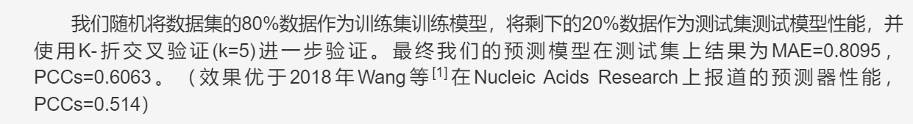

|      | 2022-model（复现） | GoogleNet | MobileNet |
| ---- | ------------------ | --------- | --------- |
| MAE  | 7.9188             | 5.0011    | 5.2287    |
| PCC  | 0.5367             | 0.6775    | 0.6858    |
| R²   | 0.3442             | 0.4296    | 0.4309    |

