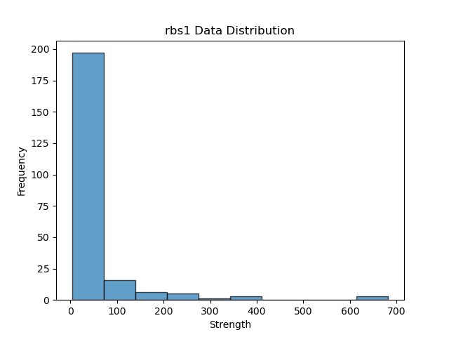

### 数据集

rbs 232 条长度为 30的序列



### 编码方式

- one-hot 编码

```python
char_map = {
    'A': [1, 0, 0, 0],
    'T': [0, 1, 0, 0],
    'C': [0, 0, 1, 0],
    'G': [0, 0, 0, 1]
}
```

- dimer 编码**(理化特性)**

将两个碱基为一组进行编码，用 长度为16 的向量

```py
char_map = {
	'AA' = [1, 0, 0, 0, 0, 0, 0, 0, 0, 0, 0, 0, 0, 0, 0, 0],
    'AT' = [0, 1, 0, 0, 0, 0, 0, 0, 0, 0, 0, 0, 0, 0, 0, 0],
    'AC' = [0, 0, 1, 0, 0, 0, 0, 0, 0, 0, 0, 0, 0, 0, 0, 0],
   	'AG' = [0, 0, 0, 1, 0, 0, 0, 0, 0, 0, 0, 0, 0, 0, 0, 0],
    'TA' = [0, 0, 0, 0, 1, 0, 0, 0, 0, 0, 0, 0, 0, 0, 0, 0]
	...
 }
```

- triplet 编码

将三个碱基为一组进行编码，用 长度为64 的向量

表示如‘AAA’会被编码为[1,0,...,0]

一个长度为30的序列会被编码成为一个64*28的矩阵

### 模型

**EnsembleNet_M**

`EnsembleNet_M` 模型是一个集成模型，它由两个 `MobileNet` 模型（即 `self.mobilenet_dimer` 和 `self.mobilenet_triplet`）组成。这两个模型分别以不同的方式编码输入数据，一个使用 "dimer" 编码，另一个使用 "triplet" 编码。

整体模型的原理如下：

1. 对于输入的 "dimer" 数据（`x_dimer`），通过 `self.mobilenet_dimer` 进行前向传播。`self.mobilenet_dimer` 是一个 `MobileNet` 模型，它使用修改后的 `MobileNetV2` 架构来处理输入数据。具体地，它首先通过一个自定义的卷积层修改输入通道数，然后使用预训练的 MobileNetV2 模型提取特征，并去掉最后的分类器层。
2. 类似地，对于输入的 "triplet" 数据（`x_triplet`），通过 `self.mobilenet_triplet` 进行前向传播。`self.mobilenet_triplet` 也是一个 `MobileNet` 模型，它与 `self.mobilenet_dimer` 结构相同，但是处理的是 "triplet" 数据。
3. 在每个模型中提取的特征上，使用自适应平均池化层将特征图大小调整为 1x1。
4. 将经过池化后的 "dimer" 特征和 "triplet" 特征在第一个维度上拼接起来，形成一个新的特征张量。
5. 将拼接后的特征张量展平成一维向量，作为输入传递给全连接层（`self.fc`）。
6. 最终，通过全连接层获得模型的输出。

```py
class EnsembleNet_M(nn.Module):
    def __init__(self, num_classes, input_channels):
        super(EnsembleNet_M, self).__init__()
        self.mobilenet_dimer = MobileNet(num_classes, input_channels)
        self.mobilenet_triplet = MobileNet(num_classes, input_channels)

        self.fc = nn.Linear(1280 * 2, 1)

    def forward(self, x_dimer, x_triplet):
        # 提取两个mobilenet的features，去掉最后一层分类器
        features_dimer = self.mobilenet_dimer.mobilenet.features(x_dimer)
        features_triplet = self.mobilenet_triplet.mobilenet.features(x_triplet)
        # 将两个features的形状都调整为[64, 1280, 1, 1],定义一个自适应平均池化层，输出大小为1x1
        pool = torch.nn.AdaptiveAvgPool2d((1, 1))
        # 对两个features进行池化
        features_dimer = pool(features_dimer)
        features_triplet = pool(features_triplet)
        # 将两个features拼接起来，沿着第一维度
        features = torch.cat([features_dimer, features_triplet], dim=1)
        # 将拼接后的features展平
        features = features.view(features.size(0), -1)
        # 用全连接层得到最终的输出
        out = self.fc(features)
        return out
```

### 结果

|      | GoogleNet-dimer | GoogleNet-triplet | EnsembleNet-G | MobileNet-dimer | MobileNet-triplet | Model: EnsembleNet-M |
| ---- | --------------- | ----------------- | ------------- | --------------- | ----------------- | -------------------- |
| MAE  | 62.8698         | 54.1666           | 56.6031       | 68.8513         | 71.7249           | 65.5578              |
| PCC  | 0.8800          | 0.8856            | 0.8711        | 0.6589          | 0.7509            | 0.7724               |
| R²   | 0.3575          | 0.6028            | 0.5274        | 0.3788          | 0.4615            | 0.3894               |

